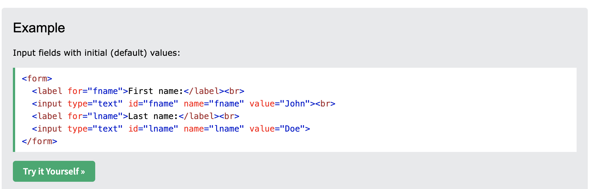
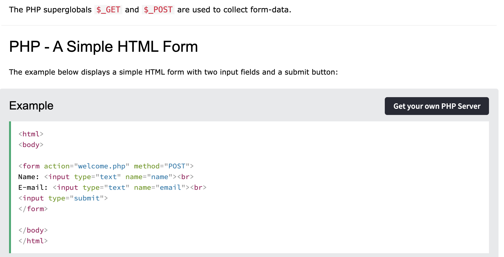

# Fahrtenprojekt

## Inhaltsverzeichnis
1. [Einleitung](#1-einleitung)
2. [Teammitglieder und Aufgabenverteilung](#2-teammitglieder-und-aufgabenverteilung)
3. [Anforderungen an das Projekt](#3-anforderungen-an-das-projekt)
4. [Technische Umsetzung](#4-technische-umsetzung)
5. [Verwendete Quellen/Literatur](#5-verwendete-quellenliteratur)

---

## 1. Einleitung

### Beschreibung
Dieses Fahrtenbuch hilft dabei, Fahrten zu speichern. Im Formular können folgende Daten eingegeben werden:
- Name
- Uhrzeit
- Datum
- Startkilometer
- Endkilometer

Die Daten werden in einer **XML-Datei** gespeichert und in einer Tabelle angezeigt.

### Projektziele
Das Ziel des Projekts ist es, eine Webanwendung zu entwickeln, mit der Fahrten dokumentiert und angezeigt werden können. So kann die Person, die das Fahrtenbuch nutzt, ihre gefahrenen Strecken einfach eintragen und nachverfolgen.

### Verwendete Technologien
- **Frontend**: HTML, CSS, JavaScript
- **Backend**: PHP
- **Datenverarbeitung**: XML

### Projektmanagement
- **Methode**: Scrum
- **Trello-Board**: [Link zum Board](https://trello.com/b/4KgWJOKe/e2it1-priyankazhazmirashella)
- **Repository**: 
  ```bash
  git clone https://github.com/cheechay/Fahrtenprojekt


----------------------------------

## Aufgabenverteilung

### Projekt-Owner
- **Oliver Metzger**

---

### Sprint 1

#### **Shella Mae Friedlein**
- **Rolle**: Entwickler/in
- **Aufgaben**:
  - Erstellung des Eingabeformulars
  - Design des Formulars
- **Story Points**:
  - Eingabeformular: **2,5 Punkte**
  - Handout: **4 Punkte**


#### **Zhazmira Borubaeva**

- **Aufgaben**:
  - Scrum Master
  - Entwicklung des Ausgabeformulars
  - Projektdokumentation
- **Story Points**:
  - Ausgabeformular: **2 Punkte**
  - Projektdokumentation: **4 Punkte**

#### **Priyanka KC**

- **Aufgaben**:
  - XML-Datenverarbeitung mit PHP
  - Korrektur falscher Daten in Auflistung
- **Story Points**:
  - XML-Datenverarbeitung: **5 Punkte**
  - Fehlerbehebung: **1,5 Punkte**

----------------------------------

## Anforderungen an das Projekt

1. **Validierung**:
   - Das Eingabeformular muss validiert werden, um sicherzustellen, dass alle Eingaben korrekt und vollständig sind.

2. **Datenverarbeitung**:
   - Die eingegebenen Daten müssen korrekt gespeichert und später fehlerfrei ausgegeben werden.

3. **Ausgabeformat**:
   - Das Ausgabeformular soll die Daten in einem übersichtlichen Tabellenformat darstellen.

4. **Benutzerfreundlichkeit**:
   - Sowohl das Eingabe- als auch das Ausgabeformular müssen übersichtlich und leicht verständlich gestaltet sein.

5. **Einheitenprüfung**:
   - Die eingegebenen Daten müssen mit den richtigen Einheiten (z. B. Kilometer, Datumsformate) versehen und verarbeitet werden.


----------------------------------


# Projektname

Ein kurzes Intro zu deinem Projekt.

-

## Technische Umsetzung des Projekts

### Technologien und Tools
- **Frontend**: HTML, CSS, JavaScript
- **Backend**: PHP
- **Datenverarbeitung**: XML
- **Versionierung**: Git und GitHub
- **Projektmanagement**: Scrum-Methodik

-

### Projektstruktur

#### 1. Eingabeformular - index.html

Das Eingabeformular ermöglicht es den Nutzern, relevante Fahrtenbuchdaten wie Name, Wohnort, Zweck, Datum und Kilometerstände zu erfassen. Das Formular nutzt HTML zur Strukturierung und CSS für das visuelle Design. Es wird durch JavaScript validiert, um sicherzustellen, dass alle Pflichtfelder korrekt ausgefüllt werden, bevor die Daten übermittelt werden.

***Wichtige Funktionen:***

**Eingabefelder:** Ermöglichen die Eingabe von Name, Wohnort, Zweck, Datum, Kilometerständen und mehr.
Google Maps Verlinkung: Ein eingebautes Google Maps-Icon bietet einen direkten Link zur Kartenanwendung, um den Standort schnell zu finden.

**Datenvalidierung:** Verhindert die Übermittlung unvollständiger oder fehlerhafter Formulardaten.

Der HTML-Code enthält auch eine benutzerfreundliche Gestaltung mit Feldern für die einfache Dateneingabe. Außerdem sind die Felder name, wohnort, und zweck als verpflichtend **(required)** validiert.


**Automatisierte Berechnungen:** Eine Funktion zur Berechnung der gefahrenen Kilometer (Differenz zwischen km_start und km_ende) könnte implementiert werden.

**Quelle** - https://www.w3schools.com/xml/xml_whatis.asp

```html

<html>

<body>

  <form action="welcome.php" method="POST">
      Name: <input type="text" name="name"><br>
      E-mail: <input type="text" name="email"><br>
    <input type="submit">
  </form>

</body>
</html>

-- @Quelle - https://www.w3schools.com/html/html_form_attributes.asp






```


# 2. Datenverarbeitung mit PHP:

Die Verarbeitung und Speicherung der Benutzereingaben in einer XML-Datei. Dies wird durch die Verarbeitung des Formulars in PHP realisiert.

2.1. Eingabedaten aus dem Formular
Die Benutzerdaten werden mittels $_POST-Methode an das Backend übermittelt und anschließend mit der Funktion filter_input() validiert.

```php

if ($_SERVER['REQUEST_METHOD'] == 'POST') {
    $name = filter_input(INPUT_POST, 'name', FILTER_DEFAULT);
    $wohnort = filter_input(INPUT_POST, 'wohnort', FILTER_DEFAULT);
    $zweck = filter_input(INPUT_POST, 'zweck', FILTER_DEFAULT);
    $datum = $_POST['datum'];
    $km_start = filter_input(INPUT_POST, 'km_start', FILTER_DEFAULT);
    $km_end = filter_input(INPUT_POST, 'km_end', FILTER_DEFAULT);
    $uhrzeit_von = filter_input(INPUT_POST, 'uhrzeit_von', FILTER_DEFAULT);
    $uhrzeit_bis = filter_input(INPUT_POST, 'uhrzeit_bis', FILTER_DEFAULT);

    // Berechnung der Kilometerdifferenz
    $kmdiff = (int) $km_end - (int) $km_start;
}

```


2.2. Datenvalidierung und Fehlerbehandlung


Der Kilometer-Endwert (km_end) darf nicht kleiner sein als der Kilometer-Startwert (km_start).

Die Endzeit (uhrzeit_bis) darf nicht vor der Startzeit (uhrzeit_von) liegen.

```javascript

if (uhrzeit_von >= uhrzeit_bis && kmStart >= kmEnd) {
    alert('Bitte, Eingaben überprüfen☹️ !!');
    return false;
}
```


2.3. Speicherung der Daten in einer XML-Datei

In PHP wird dazu ein SimpleXMLElement-Objekt genutzt, um die Daten in die XML-Struktur einzufügen.

```php
$xml = simplexml_load_file('fahrtenbuch.xml'); // Laden der bestehenden XML-Datei
$entry = $xml->addChild('entry');
$entry->addChild('name', $name);
$entry->addChild('wohnort', $wohnort);
usw.
$xml->asXML('fahrtenbuch.xml'); // Speichern der aktualisierten XML-Datei

```

```xml

<data>
  <entry>
    <distance>15.3</distance>
    <date>2025-01-20</date>
  </entry>
</data>

```

#### 3 Ausgabe-Formular 

Datenquelle (XML-Datei):

Alle Einträge des Fahrtenbuchs werden aus einer XML-Datei (fahrtenbuch.xml) geladen. Dies ist eine einfache Möglichkeit, um strukturierte Daten zu speichern und sie auf einer Webseite anzuzeigen. Das Format ermöglicht eine einfache Integration und Bearbeitung

- Die **$_GET-Anfrage** wird verwendet, um das Löschen eines Eintrags zu verarbeiten, indem die **delete_id-Variable** überprüft wird.

- Wenn ein Eintrag gelöscht werden soll, wird der entsprechende Eintrag aus der XML-Datei entfernt und die Datei neu gespeichert.
- Das XML-Dokument wird nach dem Löschen neu geladen, um die aktuelle Version anzuzeigen.
- Die foreach-Schleife durchläuft die XML-Daten und gibt für jeden Eintrag die relevanten Informationen in der Tabelle aus


- Fehlerbehandlung.
Das Formular überprüft, ob die XML-Datei korrekt geladen werden kann und gibt eine Fehlermeldung aus, wenn keine Fahrten vorhanden sind

```php

$xml = simplexml_load_file('data.xml'); //Erstellt'fahrtenbuch.xml' Datei wo, meine Ausgabe-Formular gespechert muss

Ausgabe wird ist als eine Tabelle generiert
mit der Foreach-schleife

echo "<table border='1'>";
echo "<tr><th>Entfernung (km)</th><th>Datum</th></tr>";

foreach ($xml->entry as $entry) {
    echo "<tr>";
    echo "<td>" . $entry->distance . "</td>";
    echo "<td>" . $entry->date . "</td>";
    echo "</tr>";
}

echo "</table>";

-- jede erstellte Ausgabe-Fahrten haben id, damit wir mit diesen id-s zugreifen können -> entweder löschen oder bearbeiten;

$id = isset($fahrt['id']) ? $fahrt['id'] : '';
$delete_id = isset($fahrt['id']) ? $fahrt['id'] : ''; 

foreach ($xml->fahrten as $key => $fahrt) {
    // Überprüfe, ob das 'id'-Attribut der ID entspricht
    if ((string)$fahrt['id'] === (string)$deleteId) {
        // Lösche das Element
        unset($xml->fahrten[$key]);
    }
}

```

# Quelles: 

https://www.php.net/manual/en/simplexml.examples-basic.php,  

***Screenshots:***

https://www.php.net/manual/en/simplexml.examples-basic.php

 - > (cmd+click);

 - > (cmd+click);

https://www.w3schools.com/php/php_xml_simplexml_read.asp

 

# Chat-GPT Prompts:

ChatGPT: Verwendet als Codeassistent um Unklarheiten in fremdem Code (Teammitglieder) zu verstehen oder um neue Möglichkeiten aufgezeigt zu bekommen wie bestimmte Probleme gelöst werden können.

Prompt Beispiele hierfür:

- foreach schleife in array die daten hizufügen
- id xml


