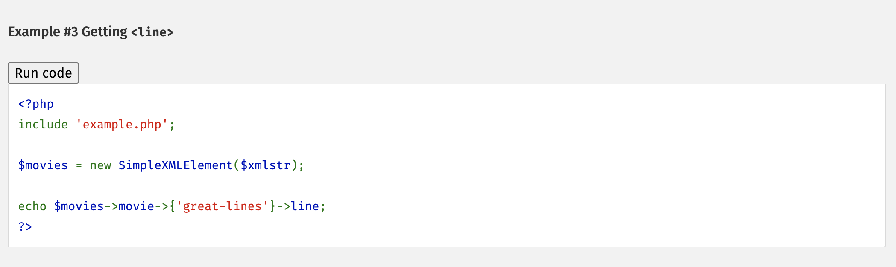
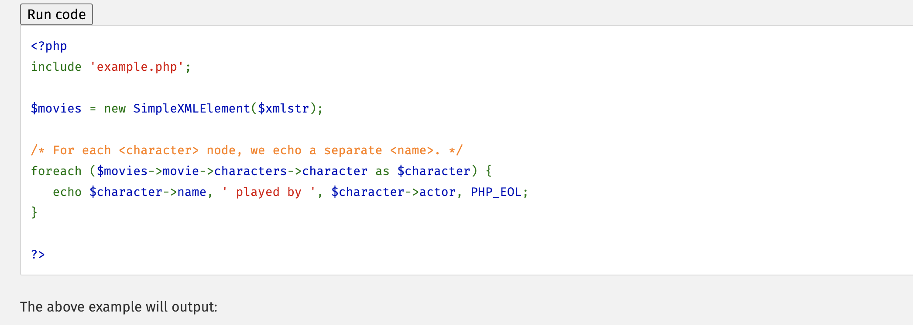
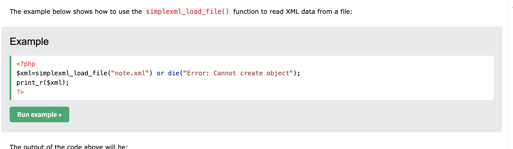

# Fahrtenprojekt

Plannung von der Dokumentation:

1. [Einleitung](#beschreibung);

2. [Teammitglieder](#Aufgabenverteilung);

3. [Anforderungen an das Projekt];

4. [Technische Umsetzung] des Projekts, mögliche Fehler und Schwierigkeiten beim lernen und verstehen.

----------------------------------

# 1. Einleitung ## beschreibung;

Beschreibung: Dieses Fahrtenbuch hilft dabei, Fahrten zu speichern. Im Formular kann man den Namen, Uhrzeit, Datum, Startkilometer und Endkilometer eingeben. Die Daten werden in einer XML-Datei gespeichert und als Tabelle angezeigt.
 
Projektziele:   Das Ziel des Projekts ist es, eine Webanwendung zu erstellen, mit der Fahrten dokumentiert und angezeigt werden können. So kann die Person, die das Fahrtenbuch nutzt, ihre gefahrenen Strecken einfach eintragen und nachverfolgen.

Welche Programmier Sprache und Technologien werden genutzt: PHP,HTML,XML,JS,CSS

Projektmanagement: Scrum

- Link zur Trello Board: https://trello.com/b/4KgWJOKe/e2it1-priyankazhazmirashella

- Klone das Repository: git clone https://github.com/cheechay/Fahrtenprojekt;

----------------------------------

## Aufgabenverteilung

### Projekt-Owner
- **Oliver Metzger**

---

### Sprint 1

#### **Shella Mae Friedlein**
- **Rolle**: Entwickler/in
- **Aufgaben**:
  - Erstellung des Eingabeformulars
  - Design des Formulars
- **Story Points**:
  - Eingabeformular: **2,5 Punkte**
  - Handout: **4 Punkte**

#### **Zhazmira Borubaeva**
- **Rolle**: Scrum Master
- **Aufgaben**:
  - Entwicklung des Ausgabeformulars
  - Projektdokumentation
- **Story Points**:
  - Ausgabeformular: **2 Punkte**
  - Projektdokumentation: **4 Punkte**

#### **Priyanka KC**
- **Rolle**: Entwickler/in
- **Aufgaben**:
  - XML-Datenverarbeitung mit PHP
  - Korrektur falscher Daten in Auflistung
- **Story Points**:
  - XML-Datenverarbeitung: **5 Punkte**
  - Fehlerbehebung: **1,5 Punkte**

----------------------------------

## Anforderungen an das Projekt

1. **Validierung**:
   - Das Eingabeformular muss validiert werden, um sicherzustellen, dass alle Eingaben korrekt und vollständig sind.

2. **Datenverarbeitung**:
   - Die eingegebenen Daten müssen korrekt gespeichert und später fehlerfrei ausgegeben werden.

3. **Ausgabeformat**:
   - Das Ausgabeformular soll die Daten in einem übersichtlichen Tabellenformat darstellen.

4. **Benutzerfreundlichkeit**:
   - Sowohl das Eingabe- als auch das Ausgabeformular müssen übersichtlich und leicht verständlich gestaltet sein.

5. **Einheitenprüfung**:
   - Die eingegebenen Daten müssen mit den richtigen Einheiten (z. B. Kilometer, Datumsformate) versehen und verarbeitet werden.


----------------------------------


# Projektname

Ein kurzes Intro zu deinem Projekt.

-

## Technische Umsetzung des Projekts

### Technologien und Tools
- **Frontend**: HTML, CSS, JavaScript
- **Backend**: PHP
- **Datenverarbeitung**: XML
- **Versionierung**: Git und GitHub
- **Projektmanagement**: Scrum-Methodik

-

### Projektstruktur

#### 1. Eingabeformular

Das Eingabeformular wird mit HTML erstellt und durch JavaScript validiert.

**Quelle** - https://www.w3schools.com/xml/xml_whatis.asp


**HTML-Code für das Formular:** 
```html

<form id="dataForm">
  <label for="distance">Entfernung (in km):</label>
  <input type="number" id="distance" name="distance" required min="0" step="0.1">
  
  <label for="date">Datum:</label>
  <input type="date" id="date" name="date" required>
  
  <button type="submit">Absenden</button>
</form>

```


# 2. Datenverarbeitung mit PHP:

Die eingegebenen Daten werden im Backend verarbeitet und in einer XML-Datei gespeichert.

**PHP-Code zum Speichern der Daten:**

-*** Quelles: ***-

***ChatGPT***


```xml

<data>
  <entry>
    <distance>15.3</distance>
    <date>2025-01-20</date>
  </entry>
</data>

```


#### 3 Ausgabe-Formular 

---*** Quelles: ***---: 

***ChatGPT***, https://www.php.net/manual/en/simplexml.examples-basic.php,  

# Screenshots:

https://www.php.net/manual/en/simplexml.examples-basic.php

 - > (cmd+click);

 - > (cmd+click);

https://www.w3schools.com/php/php_xml_simplexml_read.asp

 

# Chat GPT:

<!-- von Chat-Gpt:  -->

<!-- mit Promt -> 

1. Tabelle von Daten in xml - > syntax, beispiel für einen fahrtenbuch

2. Get daten um das zu ergzeugen in xml

3. Verwende eine foreach-Schleife, um das Array zu durchlaufen und für jedes Element einen neuen Eintrag in
 der XML-Datei zu erstellen.

4. Speichere die XML-Datei nach dem Hinzufügen der neuen Einträge.


"Schreibe ein PHP-Skript, das zwei Aufgaben erledigt:

1. Ausgabeformular mit ID: Ein Formular, das ein id-Attribut enthält, mit dem der Benutzer die ID einer Fahrt angeben kann.

2. Löschen von Fahrten: Wenn der Benutzer die ID eingibt, löscht das Skript die entsprechende Fahrt aus der XML-Datei, basierend auf dieser ID.

 -->

 ----------------QUELL CODE in von CHAT-GPT------------------------------------------------------------------

```php

$xml = simplexml_load_file('data.xml'); //Erstellt'fahrtenbuch.xml' Datei wo, meine Ausgabe-Formular gespechert muss

// Ausgabe wird ist als eine Tabelle generiert
// mit der Foreach-schleife

echo "<table border='1'>";
echo "<tr><th>Entfernung (km)</th><th>Datum</th></tr>";

foreach ($xml->entry as $entry) {
    echo "<tr>";
    echo "<td>" . $entry->distance . "</td>";
    echo "<td>" . $entry->date . "</td>";
    echo "</tr>";
}

echo "</table>";

//jede erstellte Ausgabe-Fahrten haben id, damit wir mit diesen id-s zugreifen können -> entweder löschen oder bearbeiten;

$id = isset($fahrt['id']) ? $fahrt['id'] : '';
$delete_id = isset($fahrt['id']) ? $fahrt['id'] : ''; 

foreach ($xml->fahrten as $key => $fahrt) {
    // Überprüfe, ob das 'id'-Attribut der ID entspricht
    if ((string)$fahrt['id'] === (string)$deleteId) {
        // Lösche das Element
        unset($xml->fahrten[$key]);
    }
}

```

```xml

<fahrtenbuch>
  <fahrten id="1">
    <name>test one</name>
    <wohnort>Berlin</wohnort>
  </fahrten>
  <fahrten id="2">
    <name>test two</name>
    <wohnort>Hamburg</wohnort>
  </fahrten>
</fahrtenbuch>

```


